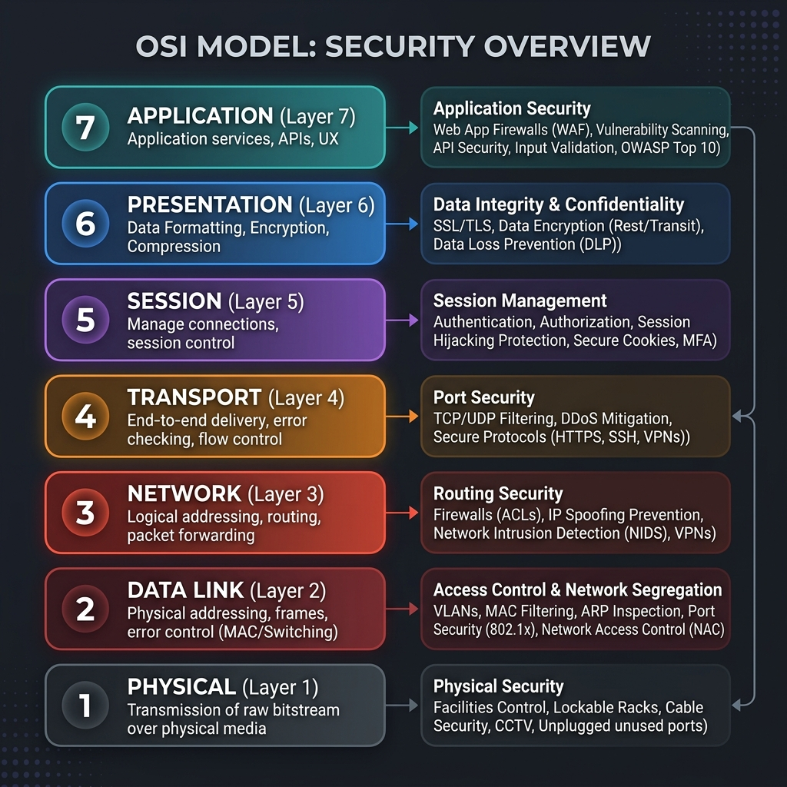
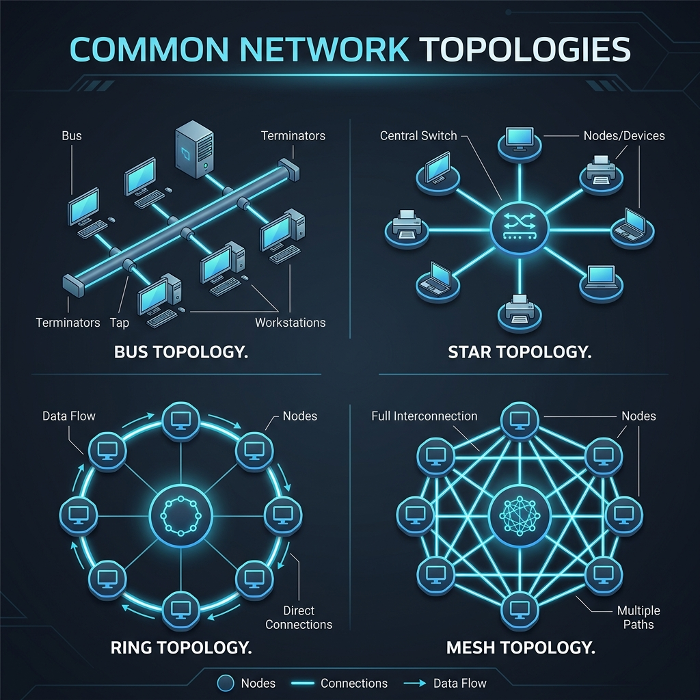

# Day 2 – Fundamentals of Networking and Security

## Overview
In this session I explored the basic building blocks of computer networking and how security is woven into each layer. The material covered the essential concepts that any security professional needs to understand before designing or defending networked systems.

## Key Topics Covered

1. **Networking Basics**
   - Definition of a network, devices (hosts, routers, switches) and the role of protocols.
   - The OSI model – detailed layer breakdown:
     - **Layer 1 – Physical**: hardware, cables, bits; security: physical access, jamming.
     - **Layer 2 – Data Link**: Ethernet, MAC addresses, switches; security: MAC filtering, VLANs.
     - **Layer 3 – Network**: IP routing, IPv4/IPv6; security: firewalls, ACLs.
     - **Layer 4 – Transport**: TCP/UDP; security: port filtering, stateful inspection.
     - **Layer 5 – Session**: session management, APIs; security: authentication, TLS handshake.
     - **Layer 6 – Presentation**: data formatting, encryption/decryption; security: SSL/TLS, encoding.
     - **Layer 7 – Application**: HTTP, DNS, SMTP; security: web application firewalls, input validation.
2. **IP Addressing & Subnetting**
   - IPv4 address structure, public vs private ranges, and CIDR notation.
   - How subnet masks segment networks and limit broadcast domains.
3. **Transport & Application Protocols**
   - TCP vs UDP characteristics and typical use‑cases.
   - Common application protocols (HTTP/HTTPS, DNS, SMTP) and their inherent security considerations.
4. **Network Security Fundamentals**
   - Defense‑in‑depth concept and the importance of layered controls.
   - Firewalls, IDS/IPS, and the role of ACLs in controlling traffic.
   - Basics of VPNs and encrypted tunnels for secure remote access.
5. **Threat Landscape at the Network Level**
   - Common attacks: sniffing, spoofing, man‑in‑the‑middle, DDoS.
   - How proper segmentation and monitoring mitigate these risks.

## Goal of the Session
To build a solid mental model of how data moves across networks and where security controls should be placed. This foundation will enable me to design effective policies for the Threat Intelligence Platform’s dynamic enforcement component.

---
## Additional Reference Material (from Video)

### OSI Model Layers

*Figure: OSI Model with security considerations*

### Common Network Topologies

*Figure: Common network topologies (Star, Bus, Ring, Mesh)*

### Common Protocols by Layer
- **Application:** HTTP, HTTPS, FTP, SMTP, DNS, SSH
- **Presentation:** SSL/TLS, JPEG, GIF, MPEG
- **Transport:** TCP, UDP
- **Network:** IP (IPv4/IPv6), ICMP, IGMP
- **Data Link:** Ethernet, Wi‑Fi (IEEE 802.11), ARP

*(Note for Coordinator: The above diagrams and extended protocols list are derived from supplementary networking session videos to reinforce the core networking foundation needed for advanced security work.)*
