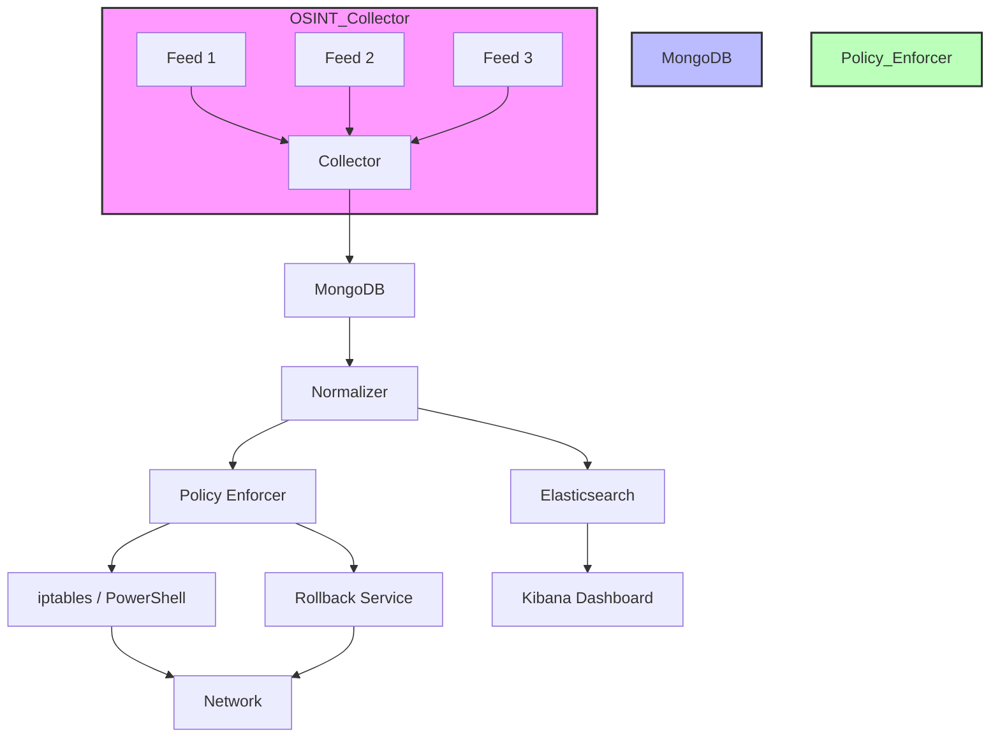

# Project 1: Finance & Banking — Advanced Threat Intelligence Platform (TIP)

## What Is Being Built

A **Threat Intelligence Platform (TIP)** combined with a **Dynamic Security Policy Enforcer** for financial institutions.

The system automatically:
- Collects global threat data from public OSINT feeds
- Normalizes and stores indicators in a database
- Pushes firewall rules in real-time to block malicious IPs/domains — no human needed

---

## Core Modules

| Module | Purpose |
|---|---|
| **Threat Aggregator** | Scrapes OSINT feeds (AlienVault OTX, VirusTotal, etc.) using Python |
| **NoSQL Store** | MongoDB stores and deduplicates threat indicators |
| **SIEM Integration** | ELK Stack (Elasticsearch + Kibana) for search and visualization |
| **Policy Enforcer** | Python daemon reads high-risk entries → fires `iptables` rules automatically |
| **Rollback Mechanism** | SOC analysts can reverse a firewall block if it's a false positive |

---

## Tech Stack

- **Language**: Python (Requests, BeautifulSoup, Subprocess)
- **Database**: MongoDB
- **SIEM**: ELK Stack (Elasticsearch, Logstash, Kibana)
- **Enforcement**: Linux `iptables` / Windows PowerShell

---

## 4-Week Build Roadmap

- **Week 1** — OSINT ingestion scripts + MongoDB setup + data deduplication
- **Week 2** — Risk scoring schema + SIEM (ELK) integration
- **Week 3** — Dynamic Policy Enforcer daemon (auto-blocking via iptables)
- **Week 4** — Rollback mechanism + Kibana dashboard + final docs & GitHub

---

## Key Users

- **SOC Analyst** — monitors dashboard, handles complex cases only
- **Security Engineer** — reviews auto-blocked IPs/domains logs
- **Compliance Officer** — audits immutable logs for PCI-DSS compliance

---

## Success Criteria

- Ingest **3+ OSINT feeds** without duplication
- Auto-execute firewall blocks for **high-severity** indicators
- Zero manual intervention required for standard threat blocking
- Full audit trail for compliance review

## Detailed Design

### Data Flow
1. OSINT Collector → MongoDB (raw indicators)
2. Normalizer → enriches, deduplicates, assigns risk score
3. SIEM Exporter → pushes to Elasticsearch for visualization
4. Policy Enforcer Daemon → queries high‑risk entries, triggers firewall rule
5. Rollback Service → listens for analyst override, removes rule, logs action

### Security Controls
- All communications between components use TLS.
- MongoDB access restricted to internal network, authentication via SCRAM‑SHA‑256.
- ELK stack secured with X‑Pack authentication and role‑based access.
- Policy Enforcer runs with least‑privilege OS user; iptables commands executed via `sudo` with password‑less rule limited to specific script.
- Immutable audit logs stored in append‑only file system or cloud bucket with versioning.

## Future Enhancements
- Integration with commercial threat intel platforms (e.g., Recorded Future).
- Machine‑learning risk scoring model.
- Containerized deployment with Kubernetes for scalability.
- Automated incident response playbooks via SOAR integration.

## Architecture Overview



## Networking Overview


*Figure: OSI Model with security considerations*


*Figure: Common network topologies*

```

## Implementation Details

- **OSINT Collector**: Python script using `requests` and `BeautifulSoup` to pull JSON/HTML feed data.
- **Normalizer**: Deduplication logic with set operations; risk scoring based on feed confidence and indicator type.
- **MongoDB Schema**:
```json
{
  "indicator": "192.0.2.1",
  "type": "ip",
  "source": "VirusTotal",
  "confidence": 85,
  "risk_score": 92,
  "first_seen": "2026-05-01T00:00:00Z",
  "last_seen": "2026-05-20T12:00:00Z"
}
```
- **SIEM Exporter**: Logstash pipeline reads MongoDB change streams, forwards to Elasticsearch.
- **Policy Enforcer Daemon**:
```python
import subprocess, time, pymongo
client = pymongo.MongoClient()
while True:
    high_risk = client.threat.indicators.find({"risk_score": {"$gt": 80}})
    for i in high_risk:
        ip = i["indicator"]
        subprocess.run(["sudo", "iptables", "-A", "INPUT", "-s", ip, "-j", "DROP"], check=True)
    time.sleep(30)
```
- **Rollback Service**: Exposes a tiny Flask API; analysts POST to `/rollback` with indicator ID; daemon removes rule and logs action.

## Testing & Validation

- Unit tests for collector parsers (pytest).
- Integration tests using Docker Compose to spin up MongoDB, Elasticsearch, Kibana, and a netfilter sandbox.
- Simulated threat feed injection to verify automatic rule creation.
- Negative testing: ensure benign indicators never trigger firewall changes.

## Deployment & Operations

- Containerize each component with Docker; orchestrate via Docker‑Compose for dev and Kubernetes for production.
- CI/CD pipeline (GitHub Actions) builds images, runs tests, and pushes to a private registry.
- Monitoring with Prometheus‑Grafana: track collector latency, rule count, and rollback events.
- Documentation hosted in the repository’s `docs/` directory; includes runbooks for incident response.

## Project Governance

- **Stakeholders**: CTO, CISO, Compliance Officer, Security Operations Center.
- **Governance Model**: Bi‑weekly steering committee reviews roadmap, risk, and compliance metrics.
- **Change Management**: All firewall rule changes logged, reviewed, and approved via the Rollback Service API.

## Open Issues & Risks

| Risk | Mitigation |
|------|------------|
| False positive blocking | Multi‑source validation before enforcement |
| Insider threat misuse | Role‑based access, audit logs |
| Scaling firewall rules | Rate‑limit rule updates, batch processing |
| Data privacy | Store only indicator hashes, no personal data |


